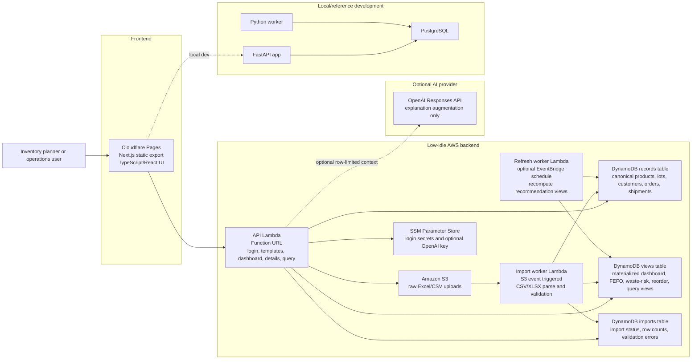

# Architecture

StockSense AI is a full-stack inventory decision-support MVP for food and CPG operators. The system ingests product, lot, order, customer, and inbound-shipment files; validates and normalizes them; computes expiration-aware recommendations; and serves dashboard, detail, report, and natural-language query experiences.

The repository supports two runtime shapes:

- Local/reference development: Next.js frontend, FastAPI backend, PostgreSQL, and a Python worker.
- Low-idle hosted MVP: Cloudflare Pages, AWS Lambda Function URL, S3, DynamoDB on-demand, S3-triggered import Lambda, optional EventBridge refresh Lambda, and SSM Parameter Store.

## C4-Style Container Diagram

## Runtime Flow

1. A user opens the Cloudflare Pages frontend.
2. The frontend authenticates against the API Lambda or local FastAPI backend.
3. The user downloads templates or uploads CSV/XLSX files.
4. Hosted flow: the API issues S3 upload targets and records import status in DynamoDB.
5. S3 object creation invokes the import worker Lambda.
6. The worker validates required columns, normalizes rows, stores canonical records, and refreshes materialized views.
7. Dashboard, SKU detail, customer detail, priority action, and query pages read from fast API endpoints.
8. Natural-language questions map to predefined safe query templates and materialized views.
9. If configured, the OpenAI layer rewrites the matched safe-view answer into planner-ready explanation text. It does not generate SQL or choose tables.

## Deployment Shape

### Public Frontend

- Static Next.js export hosted on Cloudflare Pages.
- `NEXT_PUBLIC_API_BASE_URL` points to the live API.
- `NEXT_PUBLIC_DEMO_MODE=true` can run the UI from bundled demo data.

### Local Backend

- FastAPI application in `backend/app`.
- PostgreSQL schema in `backend/migrations/001_init.sql`.
- Pandas/NumPy services implement FEFO, forecasting, and reorder logic.
- Docker Compose is available, but the backend can run without Docker against any reachable PostgreSQL instance.

### Low-Idle Hosted Backend

- Terraform entry point: `infra/terraform`.
- Lambda Function URL exposes the API without an always-on container.
- S3 stores raw uploaded files.
- DynamoDB on-demand stores canonical records, import status, and materialized views.
- S3 events trigger import work only when files arrive.
- Optional EventBridge Scheduler triggers periodic recommendation refresh.
- SSM Parameter Store holds login secrets and the optional OpenAI key.

## Key Constraints

- Keep MVP idle cost low, ideally under $10/month for low-traffic pilots.
- Avoid hardcoded credentials and keep secrets in environment variables or SSM.
- Do not depend on live SAP or Oracle credentials for first evaluation.
- Keep natural-language query safe by using predefined templates and materialized views, not arbitrary SQL generation.
- Keep forecasting explainable before adding more advanced ML.
- Preserve a local PostgreSQL/FastAPI path for richer relational development and future paid-pilot deployments.

## Important Tradeoffs

- DynamoDB materialized views are less flexible than relational SQL, but better aligned with a near-zero-idle hosted MVP.
- Lambda Function URLs are simpler and cheaper for the MVP than an always-on API container, but production pilots may eventually need API Gateway, WAF, richer auth, and observability.
- CSV/XLSX imports are batch-oriented, but they avoid long enterprise integration cycles during early validation.
- The AI layer improves explanation quality, but deterministic rule-based fallback remains the source of operational safety.
