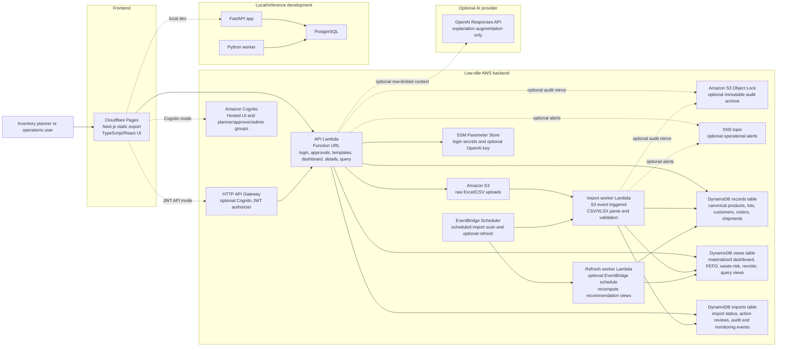

# Architecture

StockSense AI is a full-stack inventory decision-support MVP for food and CPG operators. The system ingests product, lot, order, customer, and inbound-shipment files; validates and normalizes them; computes expiration-aware recommendations; and serves dashboard, detail, report, and natural-language query experiences.

The repository supports two runtime shapes:

- Local/reference development: Next.js frontend, FastAPI backend, PostgreSQL, and a Python worker.
- Low-idle hosted MVP: Cloudflare Pages, AWS Lambda Function URL or Cognito-protected HTTP API Gateway, S3, DynamoDB on-demand, S3-triggered and scheduled import Lambda, optional EventBridge refresh Lambda, immutable audit archive option, SNS alert option, and SSM Parameter Store.
- Pilot tenant partitioning: `TENANT_ID` config scopes hosted DynamoDB records under `tenant#{TENANT_ID}` and bearer tokens are rejected when their tenant claim does not match the runtime tenant.

## C4-Style Container Diagram

## Runtime Flow

1. A user opens the Cloudflare Pages frontend.
2. The frontend authenticates against the API Lambda, Cognito Hosted UI + API Gateway, or local FastAPI backend.
3. The user downloads templates or uploads CSV/XLSX files.
4. Hosted flow: the API issues S3 upload targets and records import status in DynamoDB.
5. S3 object creation invokes the import worker Lambda; optional scheduled scans also pick up ERP/SFTP-bridged files from configured S3 landing prefixes.
6. The worker validates required columns, normalizes rows, stores canonical records, and refreshes materialized views.
7. Dashboard, SKU detail, customer detail, priority action, status, and query pages read from fast API endpoints.
8. Planner action reviews persist through the API in live mode, with browser-local fallback for demo/offline evaluation.
9. Planner roles can add notes and dismiss; approver/admin roles are required to approve actions and clear review history.
10. Monitoring summarizes API errors, import failures, slow requests/jobs, and failed AI calls from audit/import records.
11. Optional immutable audit archive mirrors audit events into an S3 Object Lock bucket; optional SNS alerts notify operators of failures.
12. Natural-language questions map to predefined safe query templates and materialized views.
13. Query answers include deterministic source citations for the matched materialized view, columns, row count, and sample row identifiers.
14. If configured, the OpenAI layer rewrites the matched safe-view answer into planner-ready explanation text. It does not generate SQL or choose tables.

## Deployment Shape

### Public Frontend

- Static Next.js export hosted on Cloudflare Pages.
- `NEXT_PUBLIC_API_BASE_URL` points to the live API.
- `NEXT_PUBLIC_DEMO_MODE=true` can run the UI from bundled demo data.
- `NEXT_PUBLIC_AUTH_MODE=cognito` enables Cognito Hosted UI login and API Gateway JWT access.

### Local Backend

- FastAPI application in `backend/app`.
- PostgreSQL schema in `backend/migrations/001_init.sql`.
- Pandas/NumPy services implement FEFO, forecasting, and reorder logic.
- Docker Compose is available, but the backend can run without Docker against any reachable PostgreSQL instance.

### Low-Idle Hosted Backend

- Terraform entry point: `infra/terraform`.
- Lambda Function URL exposes the API without an always-on container for the lowest-friction pilot mode.
- Optional Cognito + HTTP API Gateway validates JWTs before Lambda invocation for stronger buyer pilots.
- S3 stores raw uploaded files.
- DynamoDB on-demand stores canonical records, import status, and materialized views.
- S3 events trigger import work when files arrive; optional scheduled import scans pick up direct S3 or SFTP-bridged files that land under configured prefixes.
- Optional EventBridge Scheduler triggers periodic recommendation refresh.
- Optional S3 Object Lock bucket stores immutable audit JSON copies.
- Optional SNS topic sends operational alerts.
- SSM Parameter Store holds login secrets and the optional OpenAI key.
- `TENANT_ID` selects the logical DynamoDB partition for a pilot environment and binds issued tokens to that tenant.
- Pilot RBAC uses configurable users and roles from environment variables or SSM SecureString JSON. Cognito mode uses `planner`, `approver`, and `admin` groups.

## Key Constraints

- Keep MVP idle cost low, ideally under $10/month for low-traffic pilots.
- Avoid hardcoded credentials and keep secrets in environment variables or SSM.
- Avoid hardcoded tenant partitions so future pilots can be configured without source-code edits.
- Keep approval, monitoring, audit archive, and alert controls low-idle by reusing Lambda, DynamoDB, S3, and SNS primitives.
- Do not depend on live SAP or Oracle credentials for first evaluation.
- Keep natural-language query safe by using predefined templates and materialized views, not arbitrary SQL generation.
- Keep forecasting explainable before adding more advanced ML.
- Preserve a local PostgreSQL/FastAPI path for richer relational development and future paid-pilot deployments.

## Important Tradeoffs

- DynamoDB materialized views are less flexible than relational SQL, but better aligned with a near-zero-idle hosted MVP.
- Lambda Function URLs are simpler and cheaper for the MVP than an always-on API container. Cognito + HTTP API Gateway is now available for stronger pilots. This low-idle stack does not create AWS WAF resources; API-request WAF would require CloudFront or REST API Gateway.
- Pilot RBAC, Cognito option, Audit-page CSV export, immutable audit archive option, SNS alert option, and Status-page monitoring are enough for controlled evaluation, but enterprise rollouts should still add admin lifecycle workflows, SIEM forwarding, formal retention policy review, and incident runbooks.
- CSV/XLSX imports and scheduled S3/SFTP-landed files are batch-oriented, but they avoid long enterprise integration cycles during early validation.
- The AI layer improves explanation quality, but deterministic rule-based fallback remains the source of operational safety.
