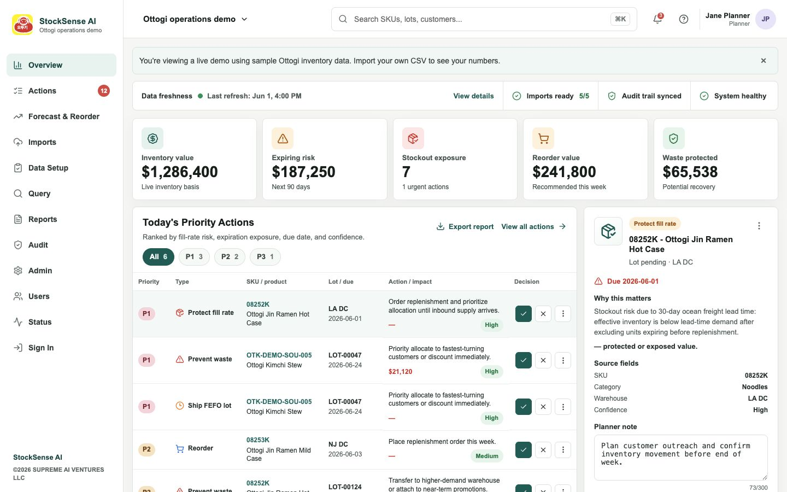
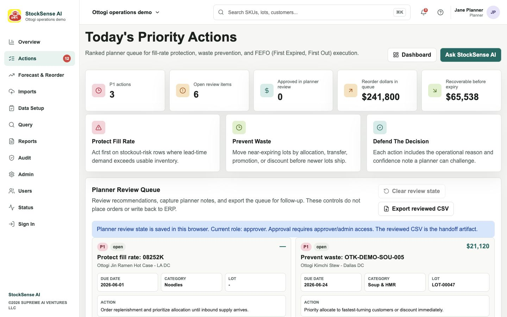
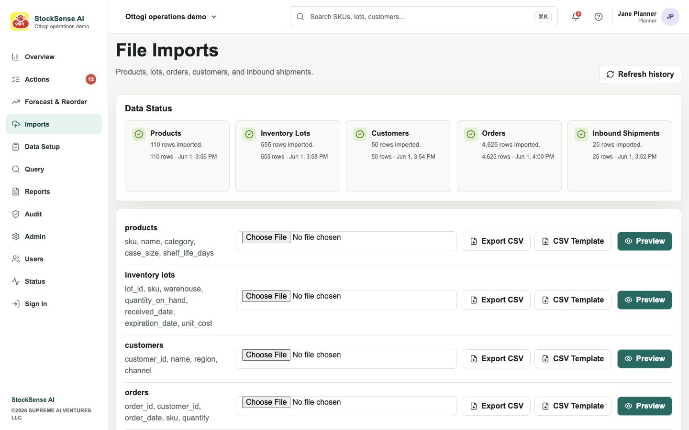
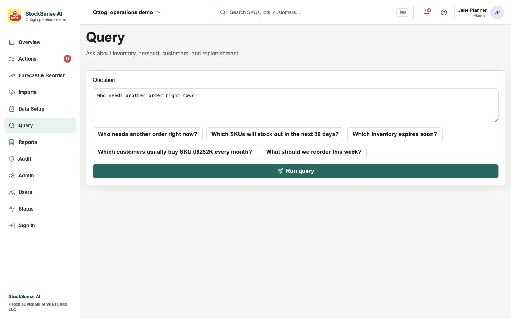
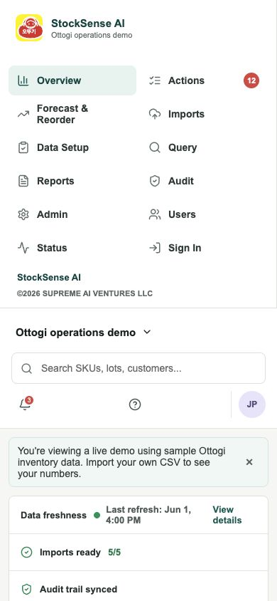

# StockSense AI Product Walkthrough

These screenshots show StockSense AI using fictional Ottogi-style sample data in demo mode. They are committed to the repository so reviewers can inspect the UI and workflow without needing a live account.

## Command Dashboard

The dashboard gives planners a single operations view: data freshness, live KPI cards, ranked priority actions, and an action detail panel with source fields and planner notes.

## Priority Actions

The Actions page turns model output into a planner review queue. Each recommendation shows priority, business reason, due date, financial exposure, and review controls without writing back to ERP.

## Data Imports

The import flow supports products, inventory lots, customers, orders, and inbound shipments. Each file type has template/export controls, preview, validation status, and import history.

## Natural-Language Query

The query surface gives operators guided prompts for common planning questions such as stockout risk, expiring inventory, reorder needs, and customer demand patterns.

## Mobile Layout

The dashboard is responsive for quick checks from a phone, with navigation, workspace context, search, status, and KPI surfaces retained in a narrow viewport.

